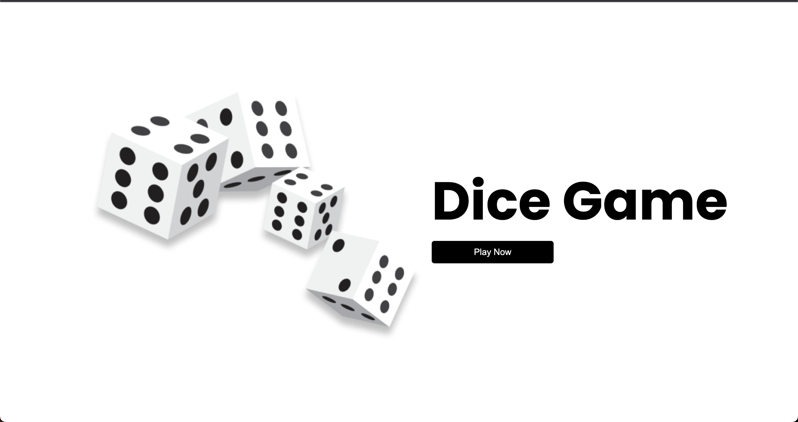

# Random6

Welcome to the React Dice Game! This project is a simple web application where users can play a fun dice game. The game involves rolling a dice and trying to achieve a high score.

## Table of Contents

1. [Introduction](#introduction)
2. [Installation](#installation)
3. [Usage](#usage)
4. [Features](#features)
5. [Technologies Used](#technologies-used)
6. [Contributing](#contributing)
7. [License](#license)

## Introduction

This project is built using React.js and utilizes the Styled Components library for styling. The main goal of the game is to roll the dice and accumulate points if selected number is equal to dice number you will get same point as dice if you guess wrong then 2 points will be deducted from the overall score

## Installation

To run the project locally, follow these steps:

1. Clone the repository to your local machine.
2. Navigate to the project directory using the terminal or command prompt.
3. Run `npm install` to install the project dependencies.
4. Run `npm start` to start the development server.
5. Open your browser and visit `http://localhost:3000` to view the application.

## Features

- Interactive UI with visually appealing components.
- Random dice roll simulation to make the game engaging.
- Score tracking for each round and overall score display.

## Technologies Used

- React.js: A popular JavaScript library for building user interfaces.
- Styled Components: A CSS-in-JS library that allows writing CSS in JavaScript.
- HTML5: The markup language used for structuring the application.
- CSS3: Styling the components and layout of the application.

## Contributing

Contributions are welcome! If you find any bugs or have ideas to enhance the game, feel free to open an issue or submit a pull request. When contributing, please follow the existing code style and ensure your changes are well-tested.

1. Fork the repository on GitHub.
2. Clone your forked repository to your local development environment.
3. Create a new branch for your feature or bug fix.
4. Commit your changes and push the branch to your GitHub repository.
5. Open a pull request to the `main` branch of the original repository.

## License

The project is licensed under the [MIT License](LICENSE.md). Feel free to use, modify, and distribute the code as per the terms of the license.
